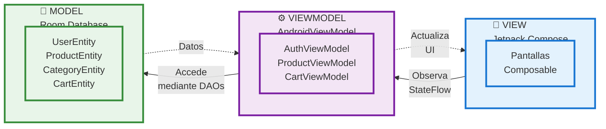

# Diagrama de Arquitectura MVVM - Mil Sabores

```mermaid
graph LR
    subgraph VIEW["🎨 VIEW<br/>Jetpack Compose"]
        direction TB
        Screens["Pantallas<br/>Composable"]
    end

    subgraph VIEWMODEL["⚙️ VIEWMODEL<br/>AndroidViewModel"]
        direction TB
        VMs["AuthViewModel<br/>ProductViewModel<br/>CartViewModel"]
    end

    subgraph MODEL["💾 MODEL<br/>Room Database"]
        direction TB
        Entities["UserEntity<br/>ProductEntity<br/>CategoryEntity<br/>CartEntity"]
    end

    VIEW -->|"Observa<br/>StateFlow"| VIEWMODEL
    VIEWMODEL -->|"Accede<br/>mediante DAOs"| MODEL
    MODEL -.->|"Datos"| VIEWMODEL
    VIEWMODEL -.->|"Actualiza<br/>UI"| VIEW

    %% Estilos
    classDef viewStyle fill:#E3F2FD,stroke:#1976D2,stroke-width:3px
    classDef viewModelStyle fill:#F3E5F5,stroke:#7B1FA2,stroke-width:3px
    classDef modelStyle fill:#E8F5E9,stroke:#388E3C,stroke-width:3px

    class VIEW,Screens viewStyle
    class VIEWMODEL,VMs viewModelStyle
    class MODEL,Entities modelStyle
```

