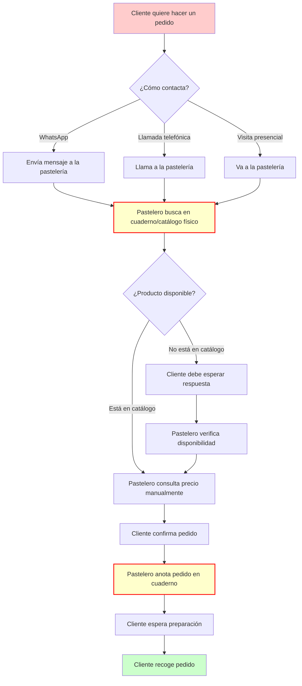

# Diagrama: Proceso Tradicional - Pastelería Mil Sabores

## Problemas del Proceso Tradicional

- **Gestión manual**: Todo se anota en cuadernos físicos
- **Catálogo limitado**: Cliente no puede ver todos los productos fácilmente
- **Comunicación lenta**: Depende de respuesta por WhatsApp
- **Sin disponibilidad en tiempo real**: Cliente no sabe si hay stock
- **Precios no transparentes**: Cliente debe consultar cada vez
- **Sin historial digital**: Pedidos anteriores se pierden o son difíciles de encontrar

